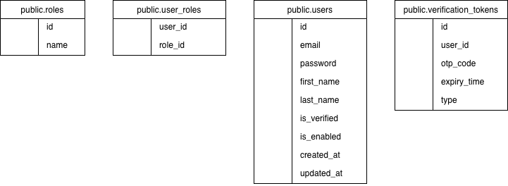

# EUEM PostgreSQL Backend Stack

A production-ready PostgreSQL database setup for the EUEM application, featuring local-only security, automated backups, and comprehensive documentation.

## Quick Start

```bash
# Clone the repository
git clone <repository-url>
cd euem_postgres

# Configure environment
cp .env.example .env  # Edit with your credentials
chmod 600 .env

# Start the database
docker compose up -d

# Verify it's running
docker compose ps
```

## Documentation

This project includes comprehensive documentation in the `docs/` directory:

- **[Usage Guide](docs/usage.md)** - How to use the database, common operations, and application integration
- **[Security Guide](docs/security.md)** - Security architecture, best practices, and hardening measures
- **[Backup Guide](docs/backup.md)** - Automated backups, recovery procedures, and retention policies
- **[Troubleshooting Guide](docs/troubleshooting.md)** - Common issues, debugging, and resolution steps

For detailed information on any topic, please refer to the appropriate documentation file.

## Architecture Overview

- **Database**: PostgreSQL 16 (Alpine Linux, ARM64)
- **Deployment**: Docker Compose
- **Security**: Local-only access (localhost connections only)
- **Features**: UUID primary keys, case-insensitive email, automatic timestamps
- **Schema**: Users, roles, user_roles (junction), verification_tokens

## Configuration

### Environment Variables

Create a `.env` file with your database credentials:

```env
POSTGRES_DB=euem_db
POSTGRES_USER=your_username
POSTGRES_PASSWORD=your_secure_password
ALLOWED_CLIENT=*
```

**Important**: Keep your `.env` file secure and never commit it to version control:
```bash
chmod 600 .env
```

### Docker Compose

The included `docker-compose.yml` provides:
- PostgreSQL 16 on Alpine Linux (ARM64)
- Automatic initialization via `/init` directory
- Data persistence via volumes
- Configurable PostgreSQL settings

Start the database:
```bash
docker compose up -d
```

## Application Integration

### Spring Boot Configuration

Connect your Spring Boot application:

```yaml
spring:
  datasource:
    url: jdbc:postgresql://localhost:5432/euem_db
    username: ${POSTGRES_USER}
    password: ${POSTGRES_PASSWORD}
  jpa:
    hibernate:
      ddl-auto: validate  # Use migrations in production
    properties:
      hibernate:
        dialect: org.hibernate.dialect.PostgreSQLDialect
```

## Database Schema

The database implements a standard user management schema with role-based access control:



**Core Tables**:
- `users` - User accounts with authentication credentials
- `roles` - Role definitions (USER, ADMIN)
- `user_roles` - Many-to-many relationship between users and roles
- `verification_tokens` - OTP codes for email verification and password resets

**Relationships**:
```
users (1)──(N) verification_tokens
users (N)──(M) roles via user_roles
```

**Key Features**:
- UUID primary keys (auto-generated)
- Case-insensitive emails using `CITEXT`
- Automatic timestamps with triggers
- Optimized indexes for query performance
- Cascade deletes for data integrity

The complete schema definition is in `init/01-init.sql` and is automatically applied on first startup.

## Common Operations

### Access the Database

```bash
# Connect via Docker
docker exec -it postgres16 psql -U your_username -d euem_db

# Or from host (if PostgreSQL client installed)
psql -h localhost -p 5432 -U your_username -d euem_db
```

### Database Management

```bash
# View running containers
docker compose ps

# View logs
docker compose logs -f db

# Stop database
docker compose stop

# Start database
docker compose start

# Restart database
docker compose restart db
```

For more detailed operations, see the [Usage Guide](docs/usage.md).

## Project Structure

```
euem_postgres/
├── docker-compose.yml      # Docker Compose configuration
├── .env                     # Environment variables (not in version control)
├── .gitignore              # Git ignore rules
├── init/
│   └── 01-init.sql        # Database initialization script
├── scripts/
│   └── backup.sh          # Automated backup script
├── docs/                   # Comprehensive documentation
│   ├── usage.md           # Usage guide
│   ├── security.md        # Security practices
│   ├── backup.md          # Backup & recovery
│   └── troubleshooting.md # Debugging guide
└── README.md              # This file
```

## Getting Help

- **Having issues?** Check the [Troubleshooting Guide](docs/troubleshooting.md)
- **Security questions?** Review the [Security Guide](docs/security.md)
- **Need to backup/restore?** See the [Backup Guide](docs/backup.md)
- **General usage?** Read the [Usage Guide](docs/usage.md)

---

**Note**: For production deployments, refer to the comprehensive guides in the `docs/` directory for security hardening, backup strategies, and operational best practices.
